Ideally, an API request should get a response within a few hundred milliseconds. A few seconds in the worst case. An endpoint that takes longer should invite scrutiny.

Anything that takes more than a few seconds is a long-running task. The brute force way to run such a task via API is just let it run **synchronously**. That creates bad experience for an API client that has to sadly wait until the task is over to know the result. Progress updates aren't possible with this method.


A common method to deal with such tasks is using some sort of **async processing**, for example a message queue. A client triggers a long-running task by calling an API endpoint (e.g. `/api/tasks/start`), which enqueues the task in a message queue and returns a unique id to track the task. A worker process consumes tasks from the queue and processes them asynchronously. The client employs a **polling mechanism** to check for status of the task by periodically hitting another endpoint (e.g. `/api/tasks/abc-123/status`).

For in-progress tasks, it may receive a response such as:
```json
{
    "status": "running"
}
```

Once the task finishes, that response may change to:
```json
{
    "status": "finished",
    "message": "Successfully finished processing the task 🎉"
}
```

Here’s a diagram illustrating the polling flow for long-running tasks with a message queue:

```mermaid
sequenceDiagram
    participant Client
    participant API
    participant Queue as "Message Queue"
    participant Worker

    Client->>API: POST /api/tasks/start
    API->>Queue: Enqueue task
    API-->>Client: { "taskId": "abc-123" }

    Worker->>Queue: Dequeue task
    Worker->>Worker: Process task

    loop Poll for status
        Client->>API: GET /api/tasks/abc-123/status
        alt Task running
            API-->>Client: { "status": "running" }
        else Task finished
            API-->>Client: { "status": "finished", "message": "Successfully finished processing the task 🎉" }
        end
    end
```



As you will note, getting progress updates is client's responsibility. Also, the additional polling step makes multiple HTTP requests, leading to expensive connection overheads.

I recently discovered a revolutionary new method to run a big task synchronously while streaming updates to client. It's called [**Server-Sent Events**](https://developer.mozilla.org/en-US/docs/Web/API/Server-sent_events/Using_server-sent_events). Okay, it's not new nor it is revolutionary. But it's really cool! 😃

Here's how it works.

Assuming your backend server supports server-sent events (should be the case with most HTTP servers today), instruct your API endpoint to respond with `text/event-stream` content and related headers. Here's how to do it in Node/Express:
```javascript
res.setHeader("Content-Type", "text/event-stream");
res.setHeader("Cache-Control", "no-cache");
res.setHeader("Connection", "keep-alive");
res.flushHeaders();
```

Then you can use `res.write` to **send progress updates** on important events:
```javascript
res.write(`data: Starting a monstrous algorithm... \n`);
...
res.write(`data: Transformation in progress...\n`);
...
res.write(`data: Time traveling through portals...\n`);
```

You can additionally **patch** `console.log` to res.write. That will capture console.logs from any function your endpoint callback might be calling.
```javascript
const origLog = console.log;
console.log = (msg, ...args) => {
    res.write(`data: ${msg}\n\n`);
    origLog(msg, ...args);
};
```

Don't forget to **restore** later.
```javascript
console.log = origLog;
```

Finally, **terminate** your event stream to signal the end of API response.
```javascript
res.write("event: end\ndata: done\n\n");
res.end();
```

Here's how progress updates will appear in an API client that support SSEs:


I recently used SSEs in the [initialize knowledge base endpoint](https://github.com/anu-rock/easy-rag/blob/d5b5569128d38d04974f157daf1f5e7c9d6e477d/api/init-kb.js) of my Easy RAG app. You are welcome to check it out.

---

Until next time,  
Cheers ✌️