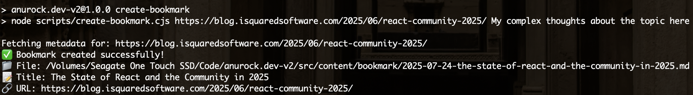
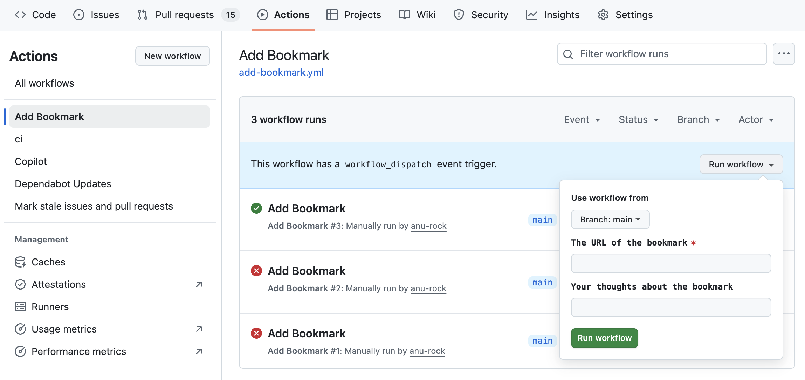

My favorite bookmarking service Pocket [shut down](https://support.mozilla.org/en-US/kb/future-of-pocket) earlier this month. I'm inclined to think whatever bookmarking service I use gets cursed. First Digg, then Delicious, now Pocket.

My first instinct was to find the next one (_to curse_ ;) ). I found Instapaper, created an account, and played around a bit. Then came the sudden realization: I didn't need another service I could not control. I could simply build a lightweight bookmarking functionality on my very own dev blog!

With an AI assistant at my disposal, I wouldn't even need a whole weekend to build it out. I ended up building it in less than 3 hours. In this tutorial, I'm laying out the high level steps to save you from falling into a rabbit hole of an overthinking AI.

Astro's [content collections feature](https://docs.astro.build/en/guides/content-collections/) is a powerful way to organize and manage your site's content. If the official documentation feels overwhelming, this guide will walk you through the process step-by-step using a practical example: creating a `bookmark` content collection to share online articles.

## Step 1: Install the Content Collections package

First, ensure you have the `@astrojs/content` package installed. It'll likely be already installed. If not, run the following command in your terminal:

```bash
npm install @astrojs/content
```

## Step 2: Configure your Astro project

Open your `astro.config.mjs` file and add the content integration: (if it doesn't exist already)

```javascript
import { defineConfig } from 'astro/config';
import content from '@astrojs/content';

export default defineConfig({
  integrations: [content()],
});
```

## Step 3: Create the Bookmark content collection

Open your `content.config.ts` file and define your new content collection at the bottom:

Inside this folder, create a schema file to define the structure of your bookmark content:

```javascript
// filepath: src/content.config.ts
const bookmark = defineCollection({
	loader: glob({ base: "./src/content/bookmark", pattern: "**/*.{md,mdx}" }),
	schema: baseSchema.extend({
		url: z.string().url(),
		excerpt: z.string(),
		readDate: z
			.string()
			.datetime({ offset: true })
			.transform((val) => new Date(val)),
	}),
});

export const collections = { post, note, bookmark }; // add bookmark to the end of your existing export
```

## Step 4: Create functions to fetch bookmark data (optional)

Handy functions if you intend to fetch bookmark data in multiple places.

```typescript
// filepath: src/data/bookmark.ts
import { type CollectionEntry, getCollection } from "astro:content";

/** get all bookmarks */
export async function getAllBookmarks(): Promise<CollectionEntry<"bookmark">[]> {
    return await getCollection("bookmark");
}

/** groups bookmarks by year (based on readDate), using the year as the key */
export function groupBookmarksByYear(bookmarks: CollectionEntry<"bookmark">[]) {
    return bookmarks.reduce<Record<string, CollectionEntry<"bookmark">[]>>((acc, bookmark) => {
        const year = bookmark.data.readDate.getFullYear();
        if (!acc[year]) {
            acc[year] = [];
        }
        acc[year]?.push(bookmark);
        return acc;
    }, {});
}
```

## Step 5: Create an Astro component to render a bookmark (optional)

Skip if you don't intend to reuse how you display bookmarks. Here's my `Bookmark` component that I use on home and bookmarks pages:

```astro
// filepath: src/components/bookmark/Bookmark.astro
---
import { type CollectionEntry, render } from "astro:content";
import FormattedDate from "@/components/FormattedDate.astro";
import type { HTMLTag, Polymorphic } from "astro/types";

type Props<Tag extends HTMLTag> = Polymorphic<{ as: Tag }> & {
	bookmark: CollectionEntry<"bookmark">;
	isPreview?: boolean | undefined;
};

const { as: Tag = "div", bookmark, isPreview = false } = Astro.props;
const { Content } = await render(bookmark);
---

<article
	class:list={[isPreview && "inline-grid rounded-md bg-blue-50 px-4 py-3 dark:bg-[rgb(33,35,38)]"]}
	data-pagefind-body={isPreview ? false : true}
>
	<Tag class="title" class:list={{ "text-base": isPreview }}>
		{
			isPreview ? (
				<a class="cactus-link" href={`/bookmarks/${bookmark.id}/`}>
					{bookmark.data.title}
				</a>
			) : (
				<>{bookmark.data.title}</>
			)
		}
	</Tag>
	<div class="mb-2 flex flex-wrap items-center gap-2 text-sm">
		<a
			href={bookmark.data.url}
			target="_blank"
			rel="noopener noreferrer"
			class="text-accent hover:underline"
		>
			Read Original →
		</a>
		<FormattedDate
			dateTimeOptions={{
				hour: "2-digit",
				minute: "2-digit",
				year: "2-digit",
				month: "2-digit",
				day: "2-digit",
			}}
			date={bookmark.data.readDate}
		/>
	</div>
	{
		!isPreview && (
			<p class="mb-3 text-sm text-gray-600 dark:text-gray-400">{bookmark.data.excerpt}</p>
		)
	}
	{
		!isPreview && (
			<div class="prose prose-sm prose-cactus mt-4 max-w-none [&>p:last-of-type]:mb-0">
				<blockquote>
					<Content />
				</blockquote>
			</div>
		)
	}
</article>
```

## Step 6: Create a page to display all your bookmarks (list page)

As with the previous step, your markup may be wildly different from mine. Pick the meaty parts and adapt accordingly. As you'll notice, my site uses Tailwind CSS.

```astro
// filepath: src/pages/bookmarks/[...page].astro
---
import { type CollectionEntry } from "astro:content";
import Pagination from "@/components/Paginator.astro";
import Bookmark from "@/components/bookmark/Bookmark.astro";
import { getAllBookmarks } from "@/data/bookmark";
import PageLayout from "@/layouts/Base.astro";
import type { GetStaticPaths, Page } from "astro";
import { Icon } from "astro-icon/components";

export const getStaticPaths = (async ({ paginate }) => {
	const MAX_BOOKMARKS_PER_PAGE = 10;
	const allBookmarks = await getAllBookmarks();
	// Sort by readDate in reverse chronological order
	const sortedBookmarks = allBookmarks.sort(
		(a, b) => b.data.readDate.getTime() - a.data.readDate.getTime(),
	);
	return paginate(sortedBookmarks, { pageSize: MAX_BOOKMARKS_PER_PAGE });
}) satisfies GetStaticPaths;

interface Props {
	page: Page<CollectionEntry<"bookmark">>;
}

const { page } = Astro.props;

const meta = {
	description: "Read my collection of bookmarks",
	title: "Bookmarks",
};

const paginationProps = {
	...(page.url.prev && {
		prevUrl: {
			text: "← Previous Page",
			url: page.url.prev,
		},
	}),
	...(page.url.next && {
		nextUrl: {
			text: "Next Page →",
			url: page.url.next,
		},
	}),
};
---

<PageLayout meta={meta}>
	<section>
		<h1 class="title mb-6 flex items-center gap-3">
			Bookmarks
			<a class="text-accent" href="/bookmarks/rss.xml" target="_blank">
				<span class="sr-only">RSS feed</span>
				<Icon aria-hidden="true" class="h-6 w-6" focusable="false" name="mdi:rss" />
			</a>
		</h1>
		<ul class="mt-6 space-y-8 text-start">
			{
				page.data.map((bookmark) => (
					<li>
						<Bookmark bookmark={bookmark} as="h2" isPreview />
					</li>
				))
			}
		</ul>
		<Pagination {...paginationProps} />
	</section>
</PageLayout>
```

## Step 7: Create a page to display one bookmark (details page)

```astro
// filepath: src/pages/bookmarks/[...slug].astro
---
import { getCollection } from "astro:content";
import Bookmark from "@/components/bookmark/Bookmark.astro";
import PageLayout from "@/layouts/Base.astro";
import type { GetStaticPaths, InferGetStaticPropsType } from "astro";

export const getStaticPaths = (async () => {
	const allBookmarks = await getCollection("bookmark");
	return allBookmarks.map((bookmark) => ({
		params: { slug: bookmark.id },
		props: { bookmark },
	}));
}) satisfies GetStaticPaths;

export type Props = InferGetStaticPropsType<typeof getStaticPaths>;

const { bookmark } = Astro.props;

const meta = {
	description: bookmark.data.excerpt,
	title: bookmark.data.title,
};
---

<PageLayout meta={meta}>
	<Bookmark as="h1" bookmark={bookmark} />
</PageLayout>
```

## Step 8: Integration

Finally, link the pages you've created above in your navigation and on your home page.

Optionally, add an RSS feed for your bookmarks:

```typescript
// filepath: src/pages/bookmarks/rss.xml.ts
import { getAllBookmarks } from "@/data/bookmark";
import { siteConfig } from "@/site.config";
import rss from "@astrojs/rss";

export const GET = async () => {
    const bookmarks = await getAllBookmarks();
    const sortedBookmarks = bookmarks.sort((a, b) => 
        b.data.readDate.getTime() - a.data.readDate.getTime()
    );
    
    return rss({
        title: `${siteConfig.title} - Bookmarks`,
        description: "My collection of bookmarks",
        site: import.meta.env.SITE,
        items: sortedBookmarks.map((bookmark) => ({
            title: bookmark.data.title,
            description: bookmark.data.excerpt,
            pubDate: bookmark.data.readDate,
            link: `bookmarks/${bookmark.id}/`,
        })),
    });
};
```

Link it in your page head:

```html
<link href="/bookmarks/rss.xml" title="Bookmarks" rel="alternate" type="application/rss+xml" />
```

## Step 9: Add your first bookmark 🎉

Add your bookmark content files in the collection folder. Each file should follow the schema you defined. For example:

```markdown
// filepath: src/content/bookmark/astro-docs.md
---
title: "Your Career Needs a Vision, Not More Goals"
url: "https://alifeengineered.substack.com/p/your-career-needs-a-vision-not-more"
excerpt: "Why you can hit every target and still feel lost. A simple 3-part framework for an intentional life."
readDate: "2025-07-23T10:46:54.789Z"
---

Deep, deep thoughts about vision, goals, and how people commonly confuse them. What beauty of an article! The central concept is similar to Cal Newport's lifestyle-centric planning, but it's nice to revisit it in the context of a software engineer.
```

## Bonus 1: npm script to add a new bookmark



Make your life easy by having a script write bookmark markdown for you. The following script takes care of extracting title, description, etc. from a URL to create a new markdown file complete with frontmatter.

Usage:

```
npm run create-bookmark https://blog.isquaredsoftware.com/2025/06/react-community-2025/ "My complex thoughts about the topic here"
```

The second param (thoughts/commentary) is optional.

```javascript
// filepath: scripts/create-bookmark.cjs
const fs = require('fs');
const path = require('path');
const { JSDOM } = require('jsdom');

const FILE_NAME = __filename || path.basename(__filename);
const DIR_NAME = path.dirname(FILE_NAME);

async function fetchPageMetadata(url) {
    try {
        const response = await fetch(url);
        if (!response.ok) {
            throw new Error(`HTTP error! status: ${response.status}`);
        }
        
        const html = await response.text();
        const dom = new JSDOM(html);
        const document = dom.window.document;

        // Extract metadata
        const title = 
            document.querySelector('meta[property="og:title"]')?.content ||
            document.querySelector('meta[name="twitter:title"]')?.content ||
            document.querySelector('title')?.textContent ||
            'Untitled';

        const description = 
            document.querySelector('meta[property="og:description"]')?.content ||
            document.querySelector('meta[name="twitter:description"]')?.content ||
            document.querySelector('meta[name="description"]')?.content ||
            '';

        const author = 
            document.querySelector('meta[name="author"]')?.content ||
            document.querySelector('meta[property="article:author"]')?.content ||
            '';

        const siteName = 
            document.querySelector('meta[property="og:site_name"]')?.content ||
            new URL(url).hostname;

        return {
            title: title.trim(),
            description: description.trim(),
            author: author.trim(),
            siteName: siteName.trim()
        };
    } catch (error) {
        console.error('Error fetching metadata:', error.message);
        return {
            title: 'Untitled',
            description: '',
            author: '',
            siteName: new URL(url).hostname
        };
    }
}

function createSlug(title) {
    return title
        .toLowerCase()
        .replace(/[^\w\s-]/g, '') // Remove special characters
        .replace(/\s+/g, '-') // Replace spaces with hyphens
        .replace(/-+/g, '-') // Replace multiple hyphens with single
        .trim();
}

function generateFrontmatter(url, metadata, thoughts) {
    const now = new Date();
    const readDate = now.toISOString();
    
    // Clean up title and description for YAML
    const cleanTitle = metadata.title.replace(/"/g, '\\"');
    const cleanDescription = metadata.description.replace(/"/g, '\\"');

    const boilerplateThoughts = `<!-- Add your notes about this bookmark here -->

${metadata.author ? `**Author:** ${metadata.author}` : ''}
${metadata.siteName ? `**Source:** ${metadata.siteName}` : ''}`;
    const thoughtsToAppend = thoughts ?? boilerplateThoughts;
    
    return `---
title: "${cleanTitle}"
url: "${url}"
excerpt: "${cleanDescription}"
readDate: "${readDate}"
---

${thoughtsToAppend}
`;
}

async function createBookmark(url, thoughts) {
    try {
        // Validate URL
        new URL(url);
        
        console.log(`Fetching metadata for: ${url}`);
        const metadata = await fetchPageMetadata(url);
        
        // Create filename from title
        const slug = createSlug(metadata.title);
        const timestamp = new Date().toISOString().split('T')[0]; // YYYY-MM-DD
        const filename = `${timestamp}-${slug}.md`;
        
        // Create bookmark content
        const content = generateFrontmatter(url, metadata, thoughts);
        
        // Ensure bookmark directory exists
        const bookmarkDir = path.join(DIR_NAME, '..', 'src', 'content', 'bookmark');
        if (!fs.existsSync(bookmarkDir)) {
            fs.mkdirSync(bookmarkDir, { recursive: true });
        }
        
        // Write file
        const filepath = path.join(bookmarkDir, filename);
        
        if (fs.existsSync(filepath)) {
            console.log(`Warning: File ${filename} already exists. Overwriting...`);
        }
        
        fs.writeFileSync(filepath, content);
        
        console.log(`✅ Bookmark created successfully!`);
        console.log(`📁 File: ${filepath}`);
        console.log(`📝 Title: ${metadata.title}`);
        console.log(`🔗 URL: ${url}`);
        
        return filepath;
    } catch (error) {
        console.error('❌ Error creating bookmark:', error.message);
        process.exit(1);
    }
}

// Main execution
const url = process.argv[2];
const thoughts = process.argv[3]; // optional

if (!url) {
    console.error('❌ Please provide a URL as an argument');
    console.log('Usage: npm run create-bookmark <url>');
    process.exit(1);
}

createBookmark(url, thoughts);
```

## Bonus 2: GitHub workflow to add a new bookmark



A neat hack to have a UI to add new bookmarks. The npm script we created above is a prerequisite.

```yaml
// filepath: .github/workflows/add-bookmark.yml
name: Add Bookmark

on:
  workflow_dispatch:
    inputs:
      url:
        description: "The URL of the bookmark"
        required: true
        type: string
      thoughts:
        description: "Your thoughts about the bookmark"
        required: false
        type: string

jobs:
  add-bookmark:
    runs-on: ubuntu-latest

    permissions:
      contents: write

    # Restrict workflow to specific users
    if: github.actor == 'anu-rock'

    steps:
      # Step 1: Checkout the repository
      - name: Checkout repository
        uses: actions/checkout@v3

      # Step 2: Set up Node.js
      - name: Set up Node.js
        uses: actions/setup-node@v3
        with:
          node-version: "22"

      # Step 3: Install dependencies
      - name: Install dependencies
        run: npm install

      # Step 4: Run the create-bookmark script
      - name: Create bookmark
        run: npm run create-bookmark "${{ github.event.inputs.url }}" "${{ github.event.inputs.thoughts }}"

      # Step 5: Commit and push changes
      - name: Commit and push changes
        run: |
          git config --global user.name "AnuRock"
          git config --global user.email "echo@anurock.dev"
          git add .
          git commit -m "Add bookmark"
          git push
```

## Conclusion

That's it! You've successfully added a `bookmark` content collection in Astro. This tutorial simplifies the process and provides a practical example. For more advanced features, refer to the [official documentation](https://docs.astro.build/en/guides/content-collections/).

Happy coding!