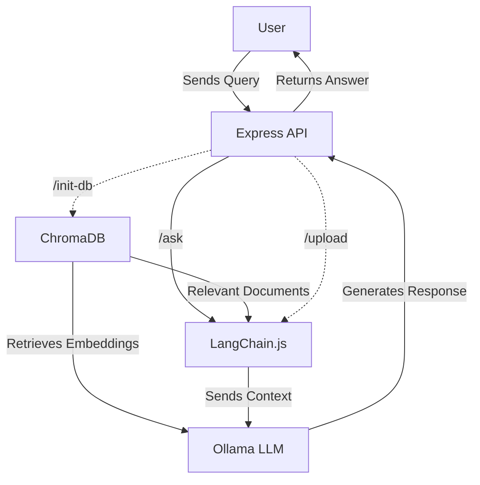

It's getting increasingly hard to imagine today's apps and services without a generative AI component. As a developer, it's important to know how gen AI works under the hood. Fine-tuning LLMs and understanding their internals may still be the territory of data science, but a sizable portion of gen AI tooling is accessible to us non-data folks (read 'developers').

While I was exposed to the developer experience side of this tooling early on (ChatGPT, GH Copilot), I remained on the fence on the software development side for far too long. Earlier this year, I took the time to catch up with the ecosystem, the terms, the tools, and the concepts — writing throwaway code to practice what I learned.

Last week I was feeling a bit inspired, so I decided to create a fully functional and easy to use [RAG search](https://en.wikipedia.org/wiki/Retrieval-augmented_generation) powered by modern tooling. I picked:

- [**LangChain.js**](https://js.langchain.com/) as my framework of choice with its nifty set of abstractions.
- [**Ollama**](https://ollama.com/) as my LLM provider which gave me access to a tonne of local-first models.
- [**ChromaDB**](https://www.trychroma.com/) as my vector database to store the custom knowledge base (documents and embeddings).
- [**Express**](https://expressjs.com/) as my framework for building API endpoints to interface with the RAG backend — `upload`, `init-db`, `ask` endpoints.

The premise is simple: **as a user, I want to query a custom knowledge base (private documents) using natural language.** The RAG system will retrieve relevant documents from the knowledge base (using semantic similarity search) and use them as context for an LLM to generate a response to my query.

Here's a slightly convoluted diagram of the flow:

The entire project is containerized using Docker, making it easy to set up and run. You can find the complete code on [GitHub](https://github.com/anu-rock/easy-rag). More details in the repo's README.

Give it a go if you want an easy-to-use RAG system to play with, or if you want to learn how to build one yourself.

---

Until next time,  
Cheers ✌️