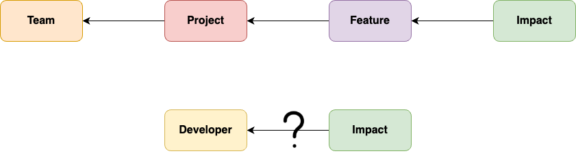

**TL;DR** Choosing the right performance metrics for developers is challenging, as common metrics like velocity, pull requests, and commits per day are often false proxies for actual performance. Instead, metrics should measure business impact, which is easier to assess at the team level. Qualitative signals like code quality, problem-solving, consistency, and growth can help evaluate individual performance within a team context.

___

## Choosing the right metrics is hard

> There are only two hard things in Computer Science: cache invalidation and naming things. - Phil Karlton

Anyone who has ever written a piece of non-hobby code will relate to the frustration of naming variables, methods, and classes. What naming things is to a programmer, choosing performance metrics is to a leader.

Creating products and experiences that customers love is unequivocally the most important goal of a software company. That's what all orgs chase, or at least attempt to chase, with utmost urgency. Unfortunately, more often than not, in a haste to deliver software other things suffer. Things like... you know... people behind software.

In theory, every org cares about its people and wants them to have the best possible environment to work. Big tech companies like to splurge big on ludicrous salaries, lavish meals, travel opportunities, napping lounges, and whatnot. Fringe benefits are typical talking points in talent acquisition. After all, happy employees translate into happy customers.

Right?

But when it comes to performance management, why do orgs take the beaten path marked by frustrations and cries of its employees?

Managers are often tasked with measuring performance of their direct reports to compensate them *fairly* and detect disengagement early. However, the metrics used for such measurements are typically **false proxies** of actual performance.

## Output vs. business impact

**Velocity** (e.g., story points) is one of the most common performance metrics. It is a subjective measure and should not be the primary KPI. It can still serve as an introspective tool—useful for team reflection but not a goal in itself.

Other popular ones include: (per month/quarter)

* 📝 Pull requests created
* ✅ Number of code reviews
* ⚠️ Tech debt issues reported
* 🕔 Commits per day (arguably the most controversial metric)

If **Joe had 50 PRs** in the last quarter and Ash had 20, does that make Joe a better developer? Or could it be that Ash worked on much harder issues than Joe? Hard to say without looking into the quality of output of both individuals, which effectively defeats the purpose of having metrics in the first place. Metrics exist to give managers a (hopefully) high-fidelity view of team/individual performance without having to review every line written by them.

The same is true for the rest. How does a high or low value for a metric correlate to the intended goals behind that metric?
* **Joe reviewed a large number of PRs.**
  * did he catch not-obvious issues?
  * did code quality improve based on review feedback?
  * were edge cases tested?
  * what all was reviewed? what was *not* reviewed?
* **Joe created a significant number of issues.**
  * is it nitpicky or a real issue?
  * was the reporting high-quality? (well-described, properly tagged, etc.)
  * could it be fixed in the same time it took to report it?
* **Joe averaged 10 commits per day.**
  * were the commits too granular? was there a real benefit to breaking a code change into smaller chunks?
  * did most commits have good titles and summaries?

The point I want to drive home is: **how important was it for the business whatever Joe worked on?** Did Joe move the mission forward? Did Joe work on pain-points customers are feeling today?

It's clear that performance metrics should ideally measure business impact[^1] rather than a developer's work output. The question then is **how do we map business impact to a developer?**

[^1]: 🎙️ stackoverflow Podcast - [Moving beyond velocity: Measuring real business impact](https://stackoverflow.blog/2025/05/08/moving-beyond-velocity-measuring-real-business-impact/)

In the real world, impact traces back to features which are implemented in projects which in turn are completed by teams. That is to say, it's easier to map impact to teams than individuals.

## Metrics based on impact

**Business impact** should be defined concretely. For example: faster delivery, better quality, cost reduction.

Business impact tends to emerge from team-level outcomes, not individual contributions in isolation. Measuring individual performance fairly and effectively in this context requires a careful balance.

Here are some qualitative signals that can help assess individual performance without undermining team cohesion:

#### Contribution Quality & Ownership

* Code quality and review feedback (PR comments, bug rate, test coverage)
* Initiative and ownership over features, tech debt, or refactoring
* Frequency and impact of code reviews (thoughtful reviews vs. rubber-stamping)

#### Problem-Solving & Technical Judgment

* Effectiveness in solution design (RFCs, design docs, PoCs)
* Ability to unblock self and others through debugging or architecture clarity
* Use of automation or tooling to reduce manual effort for the team

#### Consistency & Reliability

* Predictability of delivery (tickets completed vs. estimated)
* On-time participation in standups, planning, retros
* Follow-through on commitments and accountability

#### Growth & Learning

* Progress on personal development goals
* Uptake of new technologies or domains
* Willingness to step out of comfort zone

___

Compiling feedback based on such qualitative signals takes time, but it gives a higher fidelity view of a person's true performance over time. Not only is it useful to the org, it is far more useful to the person receiving it as compared to raw numbers that don't tell much on their own.

Until last year, it would take me a good 6-8 hours to compile one such feedback. With practice (and AI), I brought it down to 4-5 hours, including the time to discuss with the receiver and make amends.

The important thing is to set the right expectations with your team early on and  document those expectations quite visibly. That makes it so much stress-free to craft useful feedback.