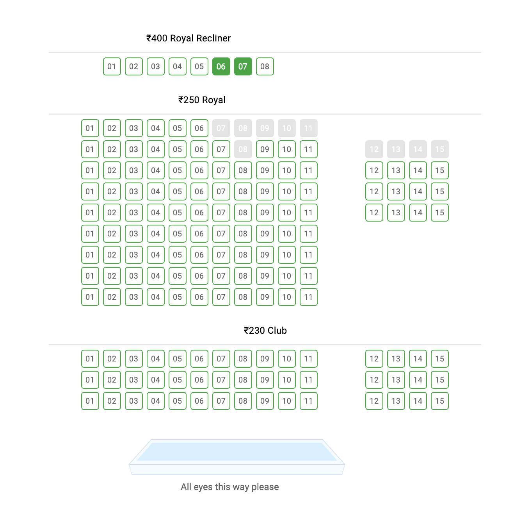
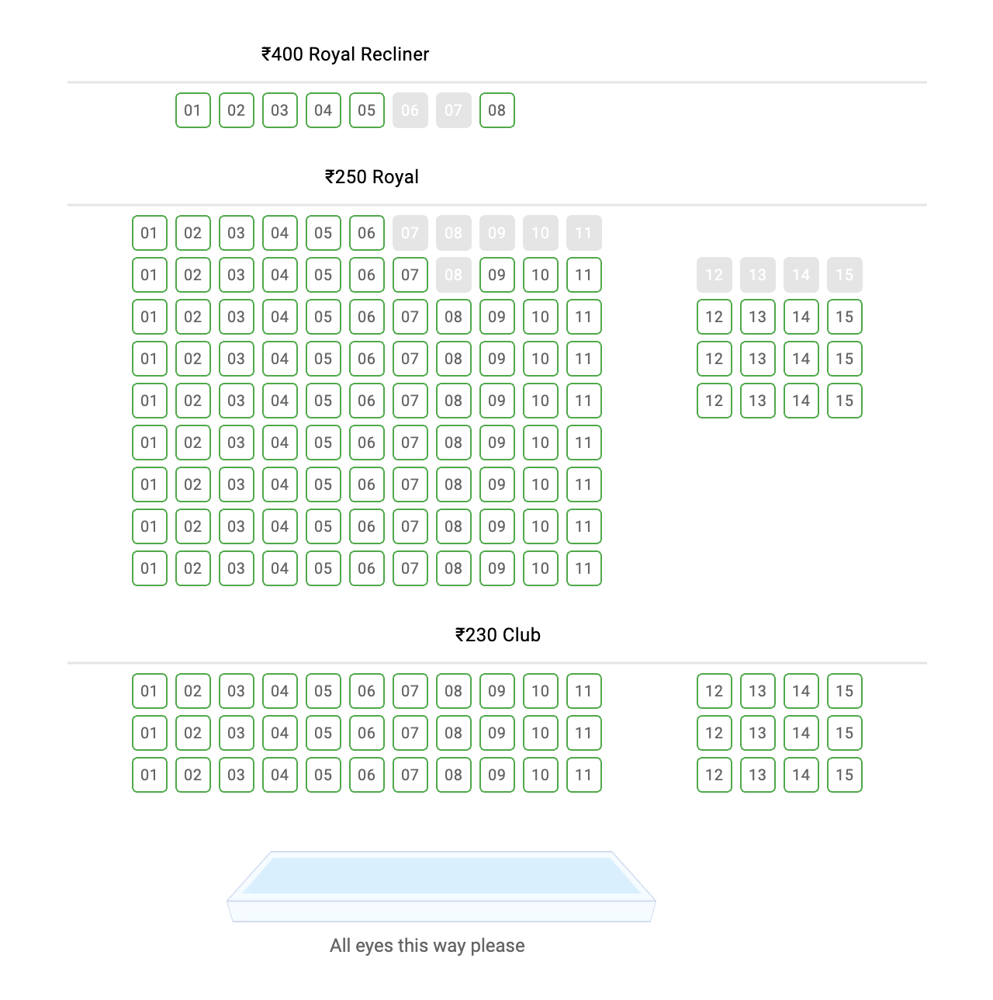

I think it's safe to say we've all experienced the frustration of trying to book movie tickets online after a failed payment or network glitch. The precious middle seats we selected earlier were no longer available. Apparently, they had been reserved for us for a set duration and weren't back into the pool as the duration hadn't expired yet.

While the frustration is completely justified, booking apps block seats temporarily to **prevent double bookings**. What would be more frustrating was if two users could book the same seat simultaneously, quite likely leading to pulled hair and angry blows in the darkness of a theater hall. Nobody wants that. Right?

Right?

:::note
IMO, booking platforms can minimize user frustrations stemming from incomplete transactions by _reliably_ detecting failures. The platform can then either continue to offer the same seats to the user or cleanly release them immediately. But that's a topic for another day.
:::

___



_User Ramesh has selected recliner seats 6 and 7 in the topmost row on bookmyshow.com._



_User Suresh (or Ramesh after a failed payment) sees recliner seats 6 and 7 as greyed out._

___

Blocking seats requires some sort of **locking mechanism** to ensure that once a seat is being booked by one user, it cannot be booked by another until the first transaction is complete or the lock expires.

There are many ways to implement such locks. Certain programming languages provide built-in constructs for locks, while databases often offer row-level locking mechanisms. However, these solutions can be complex and may not scale well in distributed systems.

I recently learned of a simpler approach using [Redis](https://redis.io), a popular in-memory key-value store, to prevent such race conditions. Here's how it works.

:::important
The following method works well with a single instance of Redis. For setups with multiple Redis instances, consider using the [Redlock algorithm](https://redis.io/docs/latest/develop/clients/patterns/distributed-locks/#the-redlock-algorithm) to ensure distributed locking.
:::

### Setting the Lock

This is as simple as using Redis' "set if not exists" command.

The following command will set a "locked" flag against the seat's unique identifier with an expiration time of 10 minutes (600,000 ms).

```bash
SET seat-112233 "locked" NX PX 600000
```

Output:
```
OK
```

So, if a seat is being booked, we attempt to set a key in Redis representing that seat. If the key doesn't exist, the command succeeds, and we proceed with the booking.

Now, if another user tries to book the same seat, the key will already exist, indicating that the seat is currently locked.

```bash
SET seat-112233 "locked" NX PX 600000
```

Output:
```
(nil)
```

In this case, the command will fail and we can inform the user accordingly.

### Releasing the Lock

Once the booking is complete (or if it fails), we **delete the key** to release the lock.

```bash
DEL seat-112233
```

Or, we can simply rely on the expiration time set during the lock creation to let the lock **expire automatically**. Not a great choice always. Remember frustrated users? Weigh your tradeoffs.

### Preventing accidental Unlocks

In a distributed system, it's possible that a process might accidentally release a lock it doesn't own. To prevent this, we can use a **unique identifier** (like a UUID) when setting the lock rather than the static "locked" string.

```javascript
import { createClient } from "redis";

const client = await createClient().connect();
```

Setting the lock:

```javascript
async function lockSeat(seatId) {
    const identifier = uuid();
    const result = await client.set(seatId, identifier, {
        NX: true,
        PX: 600000, // 10 minutes
    });
    return result === "OK" ? identifier : null;
}
```

When releasing the lock, we check if the identifier matches before deleting the key:

```javascript
async function unlockSeat(seatId, identifier) {
    const value = await client.get(seatId);
    if (value !== identifier) {
        throw new Error("Cannot unlock: identifier does not match");
    }
    return await client.del(seatId);
}
```

___

Until next time,  
Cheers ✌️